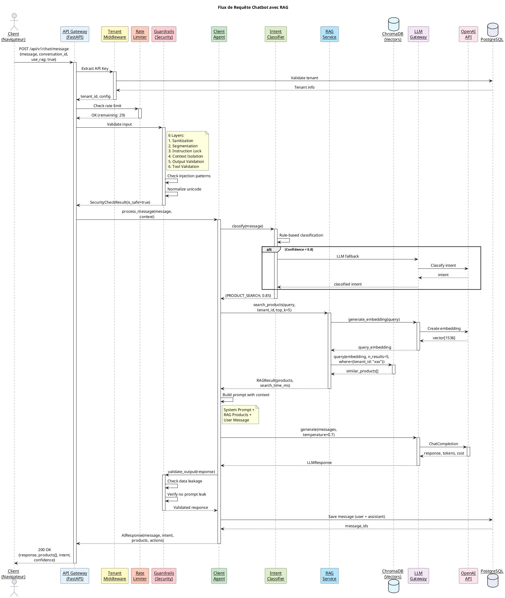
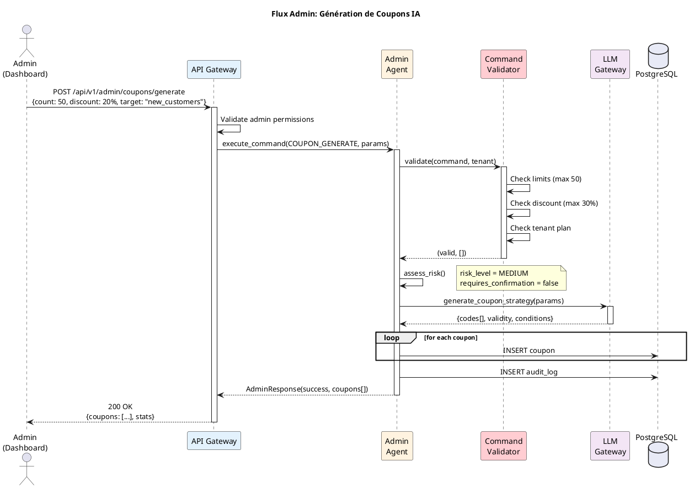
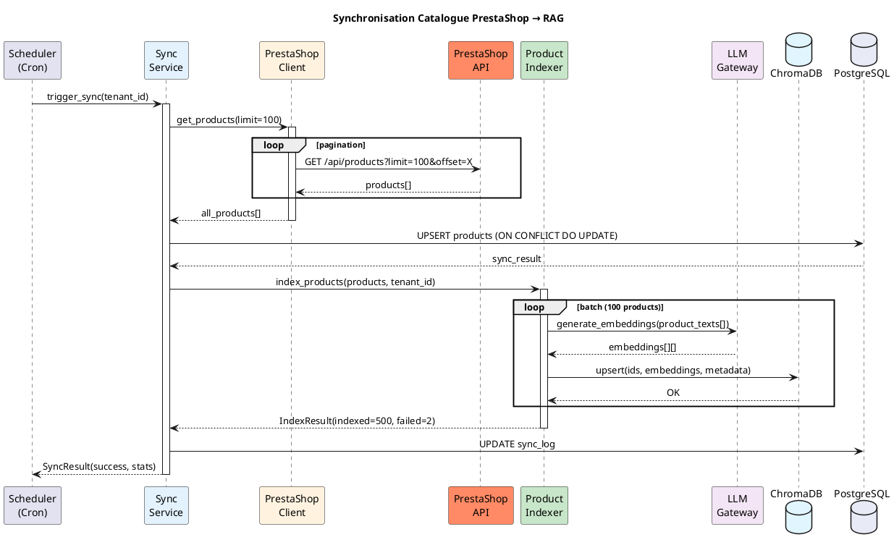

# 📐 Diagrammes de Conception - E-commerce AI Platform

## Document d'Architecture PFE

---

# 📑 Table des Matières

1. [Analyse Architecturale Globale](#1-analyse-architecturale-globale)
2. [Diagramme de Cas d'Utilisation](#2-diagramme-de-cas-dutilisation)
3. [Diagrammes de Séquence](#3-diagrammes-de-séquence)
4. [Diagramme de Classes](#4-diagramme-de-classes)
5. [Diagramme d'Architecture (C4 Container)](#5-diagramme-darchitecture-c4)
6. [Recommandations d'Amélioration](#6-recommandations-damélioration)

---

# 1. Analyse Architecturale Globale

## 1.1 Structure du Projet

```
ecommerce-ai-platform/
├── src/
│   ├── ai-core/                    # 🧠 Backend IA Principal (FastAPI)
│   │   ├── app/
│   │   │   ├── api/                # Couche API REST
│   │   │   │   ├── v1/endpoints/   # Endpoints versionnés
│   │   │   │   ├── middleware/     # Middlewares (auth, rate-limit, tenant)
│   │   │   │   └── dependencies/   # Injection de dépendances
│   │   │   ├── core/               # Configuration & Sécurité
│   │   │   │   ├── config/         # Settings, Environment
│   │   │   │   ├── security/       # Guardrails, Rate Limiter
│   │   │   │   ├── logging/        # Logging structuré
│   │   │   │   └── monitoring/     # Prometheus metrics
│   │   │   ├── domain/             # 🎯 Logique Métier (DDD)
│   │   │   │   ├── entities/       # Modèles domaine
│   │   │   │   ├── services/       # Services métier
│   │   │   │   │   ├── client/     # 👤 Agent Client
│   │   │   │   │   ├── admin/      # 👔 Agent Admin
│   │   │   │   │   └── shared/     # Services partagés (RAG, LLM, Security)
│   │   │   │   ├── repositories/   # Abstractions data access
│   │   │   │   └── events/         # Domain events
│   │   │   ├── infrastructure/     # 🔧 Implémentations Techniques
│   │   │   │   ├── database/       # PostgreSQL, Models SQLAlchemy
│   │   │   │   ├── cache/          # Redis
│   │   │   │   ├── llm/            # Providers LLM (OpenAI, Anthropic, Mock)
│   │   │   │   ├── vector_store/   # ChromaDB
│   │   │   │   └── external/       # Clients API externes
│   │   │   ├── services/           # Application Services
│   │   │   │   ├── rag/            # RAG Pipeline
│   │   │   │   └── catalog/        # Sync catalogue
│   │   │   └── workers/            # Background jobs
│   │   ├── tests/                  # Tests (270+ tests)
│   │   └── alembic/                # Migrations DB
│   ├── backoffice/                 # 🖥️ Dashboard Laravel (prévu)
│   └── platform-adapters/          # 🔌 Connecteurs E-commerce
│       ├── prestashop/             # Plugin PrestaShop
│       ├── shopify/                # Adapter Shopify
│       └── woocommerce/            # Adapter WooCommerce
└── infrastructure/
    ├── docker/                     # Docker Compose, Dockerfiles
    ├── k8s/                        # Kubernetes manifests
    ├── ci-cd/                      # GitHub Actions
    └── scripts/                    # Scripts utilitaires
```

## 1.2 Composants Principaux

### Backend Services

| Service | Technologie | Responsabilité |
|---------|-------------|----------------|
| **AI Core** | FastAPI (Python 3.11) | API REST, Orchestration IA |
| **Client Agent** | Python | Interactions client, Intent Classification |
| **Admin Agent** | Python | Opérations admin, Analytics |
| **LLM Gateway** | Python | Abstraction multi-provider LLM |
| **RAG Service** | Python + ChromaDB | Retrieval Augmented Generation |
| **Security Layer** | Python | Guardrails, Prompt Defense |

### Bases de Données

| Type | Technologie | Usage |
|------|-------------|-------|
| **Relationnelle** | PostgreSQL 15 | Tenants, Conversations, Messages |
| **Vectorielle** | ChromaDB | Embeddings produits, Recherche sémantique |
| **Cache** | Redis 7 | Sessions, Rate limiting, Cache |

### Sécurité IA (6 Couches)

```
1. INPUT SANITIZATION     → Nettoyage, Normalisation Unicode
2. PROMPT SEGMENTATION    → Séparation system/user
3. INSTRUCTION LOCKING    → Rules non-overridables
4. CONTEXT ISOLATION      → Délimitation user input
5. OUTPUT VALIDATION      → Détection data leakage
6. TOOL VALIDATION        → Schema JSON strict
```

## 1.3 Domaines Métier

| Domaine | Description |
|---------|-------------|
| **Chat** | Conversations client, Messages |
| **Catalog** | Produits, Catégories, Sync PrestaShop |
| **Tenant** | Multi-tenant SaaS, Isolation |
| **Analytics** | Métriques, Events |
| **Coupons** | Génération codes promo IA |
| **Recommendations** | Suggestions produits |

---

# 2. Diagramme de Cas d'Utilisation

## 2.1 PlantUML Code

```plantuml
@startuml UseCase_Ecommerce_AI_Platform

!define ACTOR_COLOR #E1F5FE
!define USECASE_COLOR #FFF3E0
!define SYSTEM_COLOR #E8F5E9

skinparam actorStyle awesome
skinparam packageStyle rectangle
skinparam usecase {
    BackgroundColor USECASE_COLOR
    BorderColor #FF9800
}
skinparam actor {
    BackgroundColor ACTOR_COLOR
    BorderColor #0288D1
}

' ============================================================================
' ACTEURS
' ============================================================================

actor "Client\n(Visiteur/Acheteur)" as Client #E3F2FD
actor "Administrateur\n(Marchand)" as Admin #FFF3E0
actor "Agent IA Client" as AIClient #E8F5E9
actor "Agent IA Admin" as AIAdmin #E8F5E9
actor "LLM Provider\n(OpenAI/Anthropic)" as LLM #FCE4EC

' ============================================================================
' SYSTÈME PRINCIPAL
' ============================================================================

rectangle "E-commerce AI Platform" as Platform {
    
    ' --- Zone Client ---
    package "Interactions Client" as ClientZone {
        usecase "Poser une question\nau chatbot" as UC_AskChatbot
        usecase "Rechercher un produit" as UC_SearchProduct
        usecase "Demander une\nrecommandation" as UC_GetRecommendation
        usecase "Suivre une commande" as UC_TrackOrder
        usecase "Demander un retour" as UC_RequestReturn
        usecase "Demander un\ncode promo" as UC_RequestCoupon
    }
    
    ' --- Zone Admin ---
    package "Gestion Administrative" as AdminZone {
        usecase "Générer un rapport\nanalytics" as UC_GenerateReport
        usecase "Créer des coupons\nen masse" as UC_CreateCoupons
        usecase "Modifier les prix" as UC_UpdatePrices
        usecase "Consulter les\nconversations" as UC_ViewConversations
        usecase "Configurer l'agent IA" as UC_ConfigureAgent
    }
    
    ' --- Zone IA ---
    package "Traitement IA" as AIZone {
        usecase "Classifier l'intention" as UC_ClassifyIntent
        usecase "Récupérer le contexte\n(RAG)" as UC_RetrieveRAG
        usecase "Générer une réponse" as UC_GenerateResponse
        usecase "Valider la sécurité\n(Guardrails)" as UC_ValidateSecurity
        usecase "Exécuter une action" as UC_ExecuteAction
    }
    
    ' --- Zone Sécurité ---
    package "Sécurité" as SecurityZone {
        usecase "S'authentifier\n(API Key)" as UC_Authenticate
        usecase "Détecter injection\nde prompt" as UC_DetectInjection
        usecase "Valider le tenant" as UC_ValidateTenant
    }
    
    ' --- Zone Technique ---
    package "Intégrations" as IntegrationZone {
        usecase "Synchroniser le\ncatalogue PrestaShop" as UC_SyncCatalog
        usecase "Indexer les produits\n(ChromaDB)" as UC_IndexProducts
    }
}

' ============================================================================
' RELATIONS CLIENT
' ============================================================================

Client --> UC_AskChatbot
Client --> UC_SearchProduct
Client --> UC_GetRecommendation
Client --> UC_TrackOrder
Client --> UC_RequestReturn
Client --> UC_RequestCoupon
Client --> UC_Authenticate

' ============================================================================
' RELATIONS ADMIN
' ============================================================================

Admin --> UC_GenerateReport
Admin --> UC_CreateCoupons
Admin --> UC_UpdatePrices
Admin --> UC_ViewConversations
Admin --> UC_ConfigureAgent
Admin --> UC_Authenticate

' ============================================================================
' RELATIONS AGENTS IA
' ============================================================================

AIClient --> UC_ClassifyIntent
AIClient --> UC_RetrieveRAG
AIClient --> UC_GenerateResponse
AIClient --> UC_ExecuteAction

AIAdmin --> UC_GenerateReport : <<extend>>
AIAdmin --> UC_CreateCoupons : <<extend>>
AIAdmin --> UC_UpdatePrices : <<extend>>

' ============================================================================
' RELATIONS LLM
' ============================================================================

LLM <-- UC_GenerateResponse : API Call
LLM <-- UC_ClassifyIntent : Fallback

' ============================================================================
' INCLUDES / EXTENDS
' ============================================================================

UC_AskChatbot ..> UC_ClassifyIntent : <<include>>
UC_AskChatbot ..> UC_ValidateSecurity : <<include>>
UC_AskChatbot ..> UC_RetrieveRAG : <<include>>
UC_AskChatbot ..> UC_GenerateResponse : <<include>>

UC_SearchProduct ..> UC_RetrieveRAG : <<include>>
UC_GetRecommendation ..> UC_RetrieveRAG : <<include>>

UC_ValidateSecurity ..> UC_DetectInjection : <<include>>
UC_ValidateSecurity ..> UC_ValidateTenant : <<include>>

UC_SyncCatalog ..> UC_IndexProducts : <<include>>

UC_CreateCoupons ..> UC_ValidateSecurity : <<include>>
UC_UpdatePrices ..> UC_ValidateSecurity : <<include>>

@enduml
```



## 2.2 Explication du Diagramme

### Acteurs Identifiés

| Acteur | Type | Description |
|--------|------|-------------|
| **Client** | Primaire | Visiteur ou acheteur de la boutique e-commerce |
| **Administrateur** | Primaire | Marchand gérant sa boutique via le backoffice |
| **Agent IA Client** | Système | Agent spécialisé pour les interactions client |
| **Agent IA Admin** | Système | Agent spécialisé pour les opérations admin |
| **LLM Provider** | Externe | Service LLM (OpenAI GPT-4, Anthropic Claude) |

### Cas d'Utilisation Principaux

1. **Interactions Client**
   - Question au chatbot → Classification + RAG + Réponse
   - Recherche produit → Recherche sémantique via RAG
   - Demande coupon → Génération IA conditionnelle

2. **Gestion Administrative**
   - Rapports analytics → Agent Admin analyse les données
   - Coupons en masse → Validation + Génération
   - Configuration agent → Règles métier

3. **Sécurité**
   - Authentification API Key par tenant
   - Détection injection → 6 couches de défense
   - Validation tenant → Isolation multi-tenant

---

# 3. Diagrammes de Séquence

## 3.1 Flux Principal: Requête Chatbot Client



## 3.2 Flux Admin: Génération de Coupons



## 3.3 Flux Technique: Synchronisation Catalogue PrestaShop



---

# 4. Diagramme de Classes

## 4.1 PlantUML Code

```plantuml
@startuml Class_Diagram_Global

!define ABSTRACT_COLOR #E3F2FD
!define ENTITY_COLOR #E8F5E9
!define SERVICE_COLOR #FFF3E0
!define INFRA_COLOR #FCE4EC

skinparam class {
    BackgroundColor white
    BorderColor #333333
    ArrowColor #666666
}

skinparam package {
    BackgroundColor #FAFAFA
    BorderColor #CCCCCC
}

title Diagramme de Classes - E-commerce AI Platform

' ============================================================================
' DOMAIN ENTITIES
' ============================================================================

package "Domain Entities" as DomainEntities #E8F5E9 {
    
    class Tenant <<Entity>> {
        +id: UUID
        +name: str
        +slug: str
        +api_key_hash: str
        +settings: JSONB
        +is_active: bool
        +created_at: datetime
        --
        +can_use_feature(feature: str): bool
    }
    
    class Conversation <<Entity>> {
        +id: UUID
        +tenant_id: UUID
        +user_identifier: str
        +status: ConversationStatus
        +extra_data: JSONB
        +created_at: datetime
    }
    
    class Message <<Entity>> {
        +id: UUID
        +tenant_id: UUID
        +conversation_id: UUID
        +idempotency_key: UUID
        +role: MessageRole
        +content: str
        +extra_data: JSONB
        +latency_ms: int
        +tokens_input: int
        +tokens_output: int
    }
    
    class Coupon <<Entity>> {
        +id: UUID
        +tenant_id: UUID
        +code: str
        +discount_percent: int
        +is_active: bool
        +expires_at: datetime
    }
    
    enum MessageRole {
        USER
        ASSISTANT
        SYSTEM
    }
    
    enum ConversationStatus {
        ACTIVE
        RESOLVED
        ESCALATED
        ABANDONED
    }
    
    enum IntentType {
        ORDER_STATUS
        RETURN_REQUEST
        PRODUCT_SEARCH
        RECOMMENDATION
        COUPON_REQUEST
        GENERAL
    }
}

' ============================================================================
' DOMAIN SERVICES - AGENTS
' ============================================================================

package "Domain Services - Agents" as Agents #FFF3E0 {
    
    abstract class BaseAgent <<Abstract>> {
        #llm_gateway: LLMGateway
        #rag_service: RAGService
        #security_service: SecurityService
        --
        +{abstract} process(request): Response
    }
    
    class ClientAgent <<Service>> {
        -intent_classifier: IntentClassifier
        -prompt_builder: PromptBuilder
        -action_extractor: ActionExtractor
        --
        +process_message(message, context): AIResponse
        -_classify_intent(message): IntentType
        -_retrieve_context(query, tenant_id): RAGResult
        -_generate_response(context): str
    }
    
    class AdminAgent <<Service>> {
        -command_validator: AdminCommandValidator
        -risk_assessor: RiskAssessor
        --
        +execute_command(command, params): AdminResponse
        +generate_report(type, filters): Report
        -_validate_command(cmd): ValidationResult
        -_assess_risk(cmd): RiskLevel
    }
    
    class IntentClassifier <<Service>> {
        -INTENT_PATTERNS: Dict
        --
        +classify(message, context): Tuple[IntentType, float]
        -_rule_based_classification(message): Tuple
    }
    
    class PromptBuilder <<Service>> {
        -SYSTEM_PROMPT_TEMPLATE: str
        -DANGEROUS_PATTERNS: List
        --
        +build_prompt(context): str
        +sanitize_input(text): str
    }
}

' ============================================================================
' DOMAIN SERVICES - SHARED
' ============================================================================

package "Domain Services - Shared" as SharedServices #E3F2FD {
    
    class LLMGateway <<Service>> {
        -providers: Dict[str, BaseLLMProvider]
        -cost_calculator: CostCalculator
        --
        +generate(request: LLMRequest): LLMResponse
        +generate_stream(request): AsyncGenerator
        +generate_embeddings(texts): List[List[float]]
        -_select_provider(): BaseLLMProvider
    }
    
    class RAGService <<Service>> {
        -chroma_client: ChromaClient
        -llm_gateway: LLMGateway
        --
        +search(query: RAGQuery): RAGResult
        +search_products(query, tenant_id): List[Document]
        +index_documents(docs, tenant_id): void
    }
    
    class PromptDefense <<Service>> {
        -input_sanitizer: InputSanitizer
        -output_validator: OutputValidator
        --
        +validate_input(text): SecurityCheckResult
        +validate_output(text): SecurityCheckResult
        +build_secure_prompt(parts): str
    }
    
    class SecurityService <<Service>> {
        -guardrails: List[Guardrail]
        --
        +check_all(content, context): GuardrailReport
        +is_safe(content): bool
    }
}

' ============================================================================
' INFRASTRUCTURE - LLM
' ============================================================================

package "Infrastructure - LLM" as InfraLLM #FCE4EC {
    
    abstract class BaseLLMProvider <<Abstract>> {
        +{abstract} generate(messages): Any
        +{abstract} chat(message, context): str
        +{abstract} count_tokens(text): int
        +{abstract} is_available(): bool
    }
    
    class OpenAILLMProvider <<Infrastructure>> {
        -client: AsyncOpenAI
        -model: str
        --
        +generate(messages): ChatCompletion
        +chat(message, context): str
    }
    
    class AnthropicLLMProvider <<Infrastructure>> {
        -client: AsyncAnthropic
        -model: str
        --
        +generate(messages): Message
        +chat(message, context): str
    }
    
    class MockLLMProvider <<Infrastructure>> {
        -responses: Dict
        --
        +generate(messages): MockResponse
        +chat(message, context): str
    }
}

' ============================================================================
' INFRASTRUCTURE - DATABASE
' ============================================================================

package "Infrastructure - Database" as InfraDB #F3E5F5 {
    
    class UnitOfWork <<Infrastructure>> {
        -session: AsyncSession
        +conversations: ConversationRepository
        +messages: MessageRepository
        --
        +commit(): void
        +rollback(): void
    }
    
    class ConversationRepository <<Repository>> {
        -session: AsyncSession
        --
        +get_by_id(id, tenant_id): Conversation
        +create(data): Conversation
        +get_or_create(id, tenant_id): Conversation
    }
    
    class MessageRepository <<Repository>> {
        -session: AsyncSession
        --
        +create(data): Message
        +create_idempotent(data): Tuple[Message, bool]
        +get_by_conversation(conv_id): List[Message]
    }
}

' ============================================================================
' API LAYER
' ============================================================================

package "API Layer" as APILayer #FFFDE7 {
    
    class ChatRouter <<Controller>> {
        --
        +send_message(request, body): ChatResponse
        +get_history(conversation_id): List[Message]
        +submit_feedback(feedback): void
    }
    
    class AdminRouter <<Controller>> {
        --
        +generate_coupons(params): CouponResponse
        +get_analytics(filters): AnalyticsResponse
        +update_prices(updates): PriceResponse
    }
    
    class TenantMiddleware <<Middleware>> {
        --
        +__call__(request, call_next): Response
        -_extract_tenant(request): Tenant
    }
    
    class RateLimiterMiddleware <<Middleware>> {
        -redis: Redis
        --
        +__call__(request, call_next): Response
        -_check_limit(tenant_id): bool
    }
}

' ============================================================================
' RELATIONS
' ============================================================================

' Domain Entity Relations
Tenant "1" *-- "many" Conversation
Tenant "1" *-- "many" Coupon
Conversation "1" *-- "many" Message

' Agent Relations
BaseAgent <|-- ClientAgent
BaseAgent <|-- AdminAgent
ClientAgent *-- IntentClassifier
ClientAgent *-- PromptBuilder
ClientAgent --> RAGService : uses
ClientAgent --> LLMGateway : uses

AdminAgent --> LLMGateway : uses

' Shared Services Relations
LLMGateway o-- BaseLLMProvider : aggregates
RAGService --> LLMGateway : uses embeddings
PromptDefense --> SecurityService : uses

' LLM Provider Hierarchy
BaseLLMProvider <|-- OpenAILLMProvider
BaseLLMProvider <|-- AnthropicLLMProvider
BaseLLMProvider <|-- MockLLMProvider

' Repository Relations
UnitOfWork *-- ConversationRepository
UnitOfWork *-- MessageRepository

' API Relations
ChatRouter --> ClientAgent : uses
AdminRouter --> AdminAgent : uses
ChatRouter ..> TenantMiddleware : filtered by
AdminRouter ..> RateLimiterMiddleware : limited by

@enduml
```



## 4.2 Explication des Classes

### Couche Domain (DDD)

| Classe | Pattern | Responsabilité |
|--------|---------|----------------|
| `Tenant` | Entity | Représente une boutique (isolation SaaS) |
| `Conversation` | Entity | Session de chat avec un utilisateur |
| `Message` | Entity | Message dans une conversation |
| `ClientAgent` | Domain Service | Orchestration interactions client |
| `AdminAgent` | Domain Service | Orchestration opérations admin |
| `RAGService` | Domain Service | Retrieval Augmented Generation |

### Couche Infrastructure

| Classe | Pattern | Responsabilité |
|--------|---------|----------------|
| `BaseLLMProvider` | Abstract Factory | Interface providers LLM |
| `OpenAILLMProvider` | Adapter | Implémentation OpenAI |
| `UnitOfWork` | Unit of Work | Gestion transactions |
| `*Repository` | Repository | Accès données |

### Couche API

| Classe | Pattern | Responsabilité |
|--------|---------|----------------|
| `ChatRouter` | Controller | Endpoints chat |
| `TenantMiddleware` | Middleware | Extraction tenant |
| `RateLimiterMiddleware` | Middleware | Limitation requêtes |

---

# 5. Diagramme d'Architecture (C4 Container)

## 5.1 PlantUML Code (C4 Model)

```plantuml
@startuml C4_Container_Diagram

!include https://raw.githubusercontent.com/plantuml-stdlib/C4-PlantUML/master/C4_Container.puml

!define DEVICONS https://raw.githubusercontent.com/tupadr3/plantuml-icon-font-sprites/master/devicons
!define FONTAWESOME https://raw.githubusercontent.com/tupadr3/plantuml-icon-font-sprites/master/font-awesome-5

LAYOUT_WITH_LEGEND()
LAYOUT_LEFT_RIGHT()

title C4 Container Diagram - E-commerce AI Platform

' ============================================================================
' ACTEURS EXTERNES
' ============================================================================

Person(client, "Client E-commerce", "Visiteur/Acheteur sur la boutique")
Person(admin, "Administrateur", "Marchand gérant sa boutique")

System_Ext(prestashop, "PrestaShop", "Plateforme e-commerce source")
System_Ext(openai, "OpenAI API", "GPT-4 pour génération de réponses")
System_Ext(anthropic, "Anthropic API", "Claude comme fallback LLM")

' ============================================================================
' SYSTÈME PRINCIPAL
' ============================================================================

System_Boundary(platform, "E-commerce AI Platform") {
    
    ' --- Frontend ---
    Container(widget, "Chat Widget", "JavaScript/TypeScript", "Widget intégré dans les pages e-commerce")
    Container(dashboard, "Admin Dashboard", "Laravel/Vue.js", "Interface administration (prévu)")
    
    ' --- API Gateway ---
    Container(api, "AI Core API", "FastAPI (Python 3.11)", "API REST principale\nGestion multi-tenant\nOrchestration IA")
    
    ' --- AI Agents ---
    Container(client_agent, "Client Agent", "Python", "Agent IA pour interactions client\nIntent classification\nRAG integration")
    Container(admin_agent, "Admin Agent", "Python", "Agent IA pour opérations admin\nAnalytics, Coupons, Prix")
    
    ' --- Shared Services ---
    Container(llm_gateway, "LLM Gateway", "Python", "Abstraction multi-provider\nOpenAI, Anthropic, Mock\nCost tracking")
    Container(rag_service, "RAG Service", "Python", "Retrieval Augmented Generation\nRecherche sémantique produits")
    Container(security, "Security Layer", "Python", "Guardrails (6 couches)\nPrompt injection defense")
    
    ' --- Data Stores ---
    ContainerDb(postgres, "PostgreSQL 15", "PostgreSQL", "Tenants, Conversations\nMessages, Coupons\nAnalytics events")
    ContainerDb(chromadb, "ChromaDB", "Vector Database", "Embeddings produits\nRecherche sémantique")
    ContainerDb(redis, "Redis 7", "Cache", "Sessions, Rate limiting\nCache API responses")
    
    ' --- Workers ---
    Container(sync_worker, "Sync Worker", "Python", "Synchronisation catalogue\nIndexation produits")
}

' ============================================================================
' RELATIONS
' ============================================================================

' Client Relations
Rel(client, widget, "Pose des questions", "HTTPS")
Rel(widget, api, "POST /chat/message", "REST/JSON")

' Admin Relations
Rel(admin, dashboard, "Gère la boutique", "HTTPS")
Rel(dashboard, api, "API calls", "REST/JSON")

' API to Agents
Rel(api, client_agent, "Route client requests", "Internal")
Rel(api, admin_agent, "Route admin requests", "Internal")

' Agents to Services
Rel(client_agent, llm_gateway, "Generate responses", "Internal")
Rel(client_agent, rag_service, "Retrieve context", "Internal")
Rel(client_agent, security, "Validate I/O", "Internal")

Rel(admin_agent, llm_gateway, "Generate reports", "Internal")

' LLM Gateway to External
Rel(llm_gateway, openai, "ChatCompletion API", "HTTPS")
Rel(llm_gateway, anthropic, "Messages API", "HTTPS")

' Services to Data
Rel(api, postgres, "CRUD operations", "TCP/5432")
Rel(rag_service, chromadb, "Vector queries", "HTTP/8000")
Rel(api, redis, "Cache/Sessions", "TCP/6379")

' Sync Worker
Rel(sync_worker, prestashop, "Fetch products", "REST API")
Rel(sync_worker, postgres, "Store products", "TCP/5432")
Rel(sync_worker, chromadb, "Index embeddings", "HTTP")
Rel(sync_worker, llm_gateway, "Generate embeddings", "Internal")

@enduml
```

## 5.2 Diagramme Simplifié (ASCII)

```
┌─────────────────────────────────────────────────────────────────────────────────────────────┐
│                                    E-COMMERCE AI PLATFORM                                    │
├─────────────────────────────────────────────────────────────────────────────────────────────┤
│                                                                                              │
│    ┌──────────────┐         ┌──────────────┐                                                │
│    │    Client    │         │    Admin     │                                                │
│    │  (Browser)   │         │ (Dashboard)  │                                                │
│    └──────┬───────┘         └──────┬───────┘                                                │
│           │                        │                                                         │
│           │ HTTPS                  │ HTTPS                                                   │
│           ▼                        ▼                                                         │
│    ┌──────────────────────────────────────────────────┐                                     │
│    │              API GATEWAY (FastAPI)                │                                     │
│    │  ┌─────────┐ ┌─────────┐ ┌─────────┐ ┌─────────┐ │                                     │
│    │  │  CORS   │ │ Tenant  │ │  Rate   │ │ Request │ │                                     │
│    │  │Middleware│ │ Context │ │ Limiter │ │ Logging │ │                                     │
│    │  └─────────┘ └─────────┘ └─────────┘ └─────────┘ │                                     │
│    └───────────────────────┬──────────────────────────┘                                     │
│                            │                                                                 │
│              ┌─────────────┴─────────────┐                                                  │
│              ▼                           ▼                                                  │
│    ┌─────────────────┐         ┌─────────────────┐                                         │
│    │  CLIENT AGENT   │         │   ADMIN AGENT   │                                         │
│    │                 │         │                 │                                         │
│    │ • Intent Class. │         │ • Command Valid │                                         │
│    │ • Prompt Build  │         │ • Risk Assess   │                                         │
│    │ • Action Extract│         │ • Audit Log     │                                         │
│    └────────┬────────┘         └────────┬────────┘                                         │
│             │                           │                                                   │
│             └─────────────┬─────────────┘                                                   │
│                           ▼                                                                 │
│    ┌──────────────────────────────────────────────────────────────────┐                    │
│    │                     SHARED AI SERVICES                           │                    │
│    │                                                                  │                    │
│    │  ┌──────────────┐  ┌──────────────┐  ┌──────────────────────┐   │                    │
│    │  │ LLM GATEWAY  │  │ RAG SERVICE  │  │   SECURITY LAYER     │   │                    │
│    │  │              │  │              │  │                      │   │                    │
│    │  │ • OpenAI     │  │ • Search     │  │ • Input Sanitization │   │                    │
│    │  │ • Anthropic  │  │ • Index      │  │ • Prompt Segmentation│   │                    │
│    │  │ • Mock       │  │ • Rerank     │  │ • Output Validation  │   │                    │
│    │  │ • Fallback   │  │              │  │ • 6 Defense Layers   │   │                    │
│    │  └──────┬───────┘  └──────┬───────┘  └──────────────────────┘   │                    │
│    └─────────┼─────────────────┼─────────────────────────────────────┘                    │
│              │                 │                                                           │
│              ▼                 ▼                                                           │
│    ┌─────────────────────────────────────────────────────────────────┐                    │
│    │                     DATA LAYER                                   │                    │
│    │                                                                  │                    │
│    │  ┌──────────────┐  ┌──────────────┐  ┌──────────────┐           │                    │
│    │  │ PostgreSQL   │  │  ChromaDB    │  │    Redis     │           │                    │
│    │  │              │  │              │  │              │           │                    │
│    │  │ • Tenants    │  │ • Embeddings │  │ • Cache      │           │                    │
│    │  │ • Messages   │  │ • Products   │  │ • Sessions   │           │                    │
│    │  │ • Analytics  │  │ • FAQs       │  │ • Rate Limit │           │                    │
│    │  └──────────────┘  └──────────────┘  └──────────────┘           │                    │
│    └─────────────────────────────────────────────────────────────────┘                    │
│                                                                                            │
└─────────────────────────────────────────────────────────────────────────────────────────────┘
                                        │
                    ┌───────────────────┼───────────────────┐
                    ▼                   ▼                   ▼
            ┌──────────────┐    ┌──────────────┐    ┌──────────────┐
            │   OpenAI     │    │  Anthropic   │    │  PrestaShop  │
            │   (GPT-4)    │    │  (Claude)    │    │    (API)     │
            └──────────────┘    └──────────────┘    └──────────────┘
                              EXTERNAL SERVICES
```

---

# 6. Recommandations d'Amélioration

## 6.1 Améliorations Architecturales

### 🔴 Critiques (Obligatoires)

| Problème | Impact | Solution |
|----------|--------|----------|
| **Tests échouent (30/270)** | CI bloqué | Corriger les tests `test_tenant_isolation.py` et patterns injection |
| **Conflit modèles SQLAlchemy** | Runtime error | Supprimer `models.py` legacy, utiliser nouveaux modèles |
| **Mock LLM insuffisant** | Tests fragiles | Enrichir `MockLLMProvider` avec réponses réalistes |

### 🟡 Importantes (Recommandées)

| Amélioration | Bénéfice | Effort |
|--------------|----------|--------|
| **Circuit Breaker LLM** | Résilience | 2-3h |
| **Cache réponses LLM** | Performance, Coût | 2-3h |
| **Métriques Prometheus complètes** | Observabilité | 3-4h |
| **Health checks détaillés** | Production-ready | 1-2h |

### 🟢 Optionnelles (Bonus)

| Amélioration | Bénéfice |
|--------------|----------|
| **Event Sourcing messages** | Audit complet |
| **WebSocket streaming** | UX temps réel |
| **A/B testing prompts** | Optimisation |

## 6.2 Manques pour Production

```
Production Readiness Checklist:
                                        Actuel    Cible
├── Tests                                 89%      95%    ⚠️
├── Coverage                              ~60%     80%    ⚠️
├── Documentation API (OpenAPI)           70%      100%   ⚠️
├── Logging structuré                     ✅       ✅     ✅
├── Metrics Prometheus                    Partiel  Complet ⚠️
├── Health checks                         Basique  Détaillé ⚠️
├── Rate limiting                         ✅       ✅     ✅
├── Multi-tenant isolation                ✅       ✅     ✅
├── Secrets management                    .env     Vault   ⚠️
├── CI/CD Pipeline                        ✅       ✅     ✅
├── Docker optimisé                       ✅       ✅     ✅
├── Kubernetes ready                      Partiel  Complet ⚠️
└── Disaster Recovery                     ❌       Plan    ❌
```

## 6.3 Améliorations pour Note Académique (18+/20)

### Ce qui Impressionne un Jury

| Aspect | État Actuel | Amélioration |
|--------|-------------|--------------|
| **Architecture** | ⭐⭐⭐⭐ Excellente | Diagrammes C4 propres |
| **Sécurité IA** | ⭐⭐⭐⭐⭐ Exceptionnelle | 6 couches documentées |
| **RAG** | ⭐⭐⭐⭐ Bon | Ajouter reranking avancé |
| **Tests** | ⭐⭐⭐ Moyen | Atteindre 95%+ |
| **Documentation** | ⭐⭐⭐ Moyen | README + Swagger complet |
| **Démo** | ❓ Non testé | Préparer 3 scénarios live |

### Actions Prioritaires

```
Semaine 1:
├── Corriger 30 tests échoués
├── Finaliser documentation Swagger
└── Préparer seed data

Semaine 2:
├── Créer slides avec diagrammes
├── Préparer démo live
└── Répéter présentation (5 min)
```

## 6.4 Verdict Final

| Critère | Score | Commentaire |
|---------|-------|-------------|
| **Architecture** | 85/100 | Clean Architecture, DDD, patterns solides |
| **Innovation IA** | 90/100 | RAG + 6 couches sécurité = excellent |
| **Qualité Code** | 75/100 | Bon mais tests à corriger |
| **Production-Ready** | 70/100 | Manque metrics, health checks complets |
| **Documentation** | 65/100 | À enrichir pour soutenance |

### **Score Global: 77/100**
### **Note Estimée: 16-17/20**
### **Potentiel avec corrections: 18-19/20**

---

*Document généré le 19 février 2026*
*Basé sur l'analyse du repository `ecommerce-ai-platform` branche `dev`*

